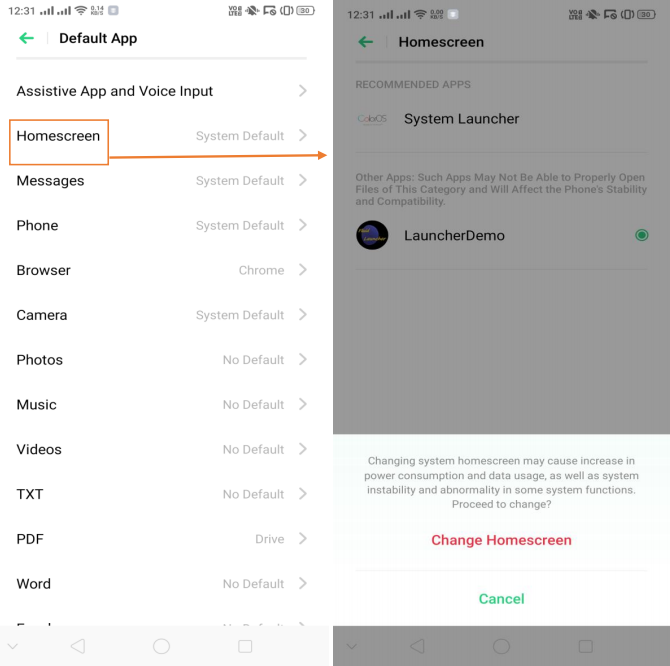
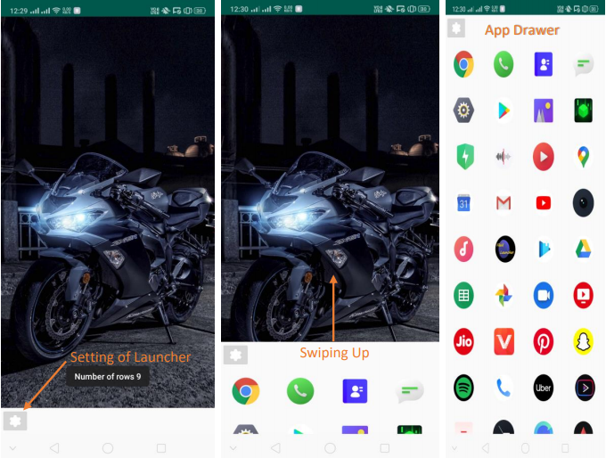
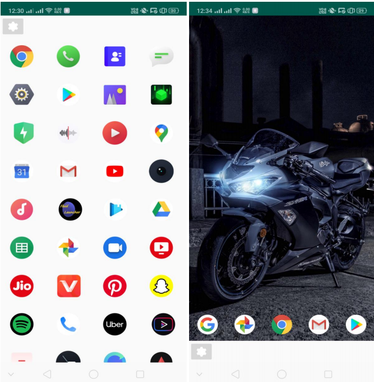
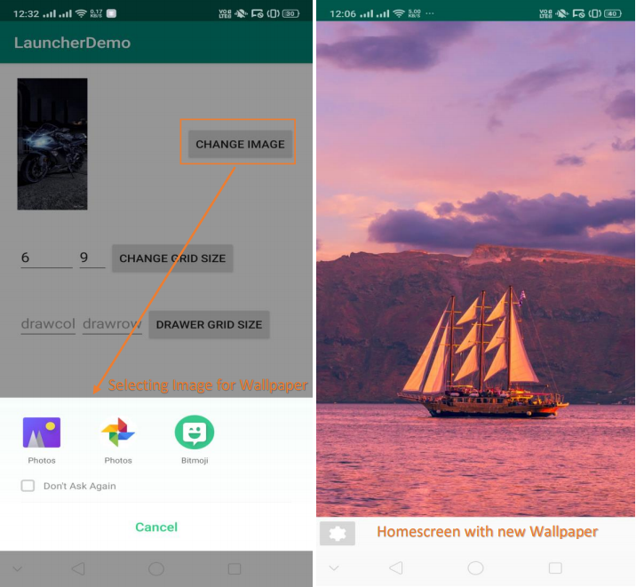
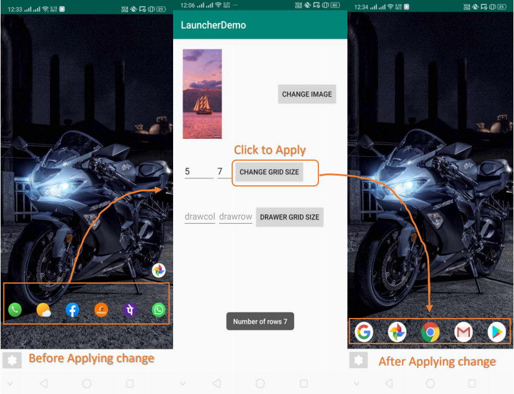
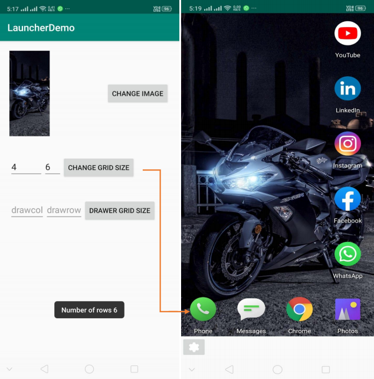

# Convenient Custom Android Launcher
This is an Convenient Custom Android Launcher made using Android Studio which is used to customize the homescreen of your smartphone.

## Objective: 
The Aim was to provide an application for better utilization of a Smart Phone for the respective user age group.\
Users above the age fifty and further have difficulty in looking for apps in their phone\
due its default icon size and number of apps installed in them.\
Similarly the younger generations like to keep their phone look minimalistic\
with reduced icon size and highlighting the wallpapers in background.\
Hence to provide a solution for this, I came up with an idea of developing\
Convenient Custom Launcher ~ "Launcher Demo" app that allows all the users of different age\
group to customize their Smartphone Home Screen as per their wish.\
Launcher is the name given Android UI that lets users customize the Home Screen

### SOME FEATURES OF THIS APP IS:

* This application is actually a replacement for the Phone's Default Launcher so\
firstly once the user installs the app then he needs to Change the Default Launcher\
from Setting to this Launcher then the user is ready to use this app.
* By doing the above step this app becomes the user's default Home Launcher.
* User can choose Wallpaper from his gallery and can just swipe up from bottom to\
open the app drawer which contains the list of apps installed in the device.
* User can also create app shortcuts by selecting apps from his app drawer to his Home screen page.
* User can also adjust the grid size of the home screen pages by editing in settings of\
the Launcher, by editing it the icon size can be increased or decreased.

### TECH USED IN BUILDING AND HOW TO INSTALL THE APP:

* Android Studio 3.8 with Java JDK -version 8 being installed.
* XML to edit the front end of the app and Layouts in Android Studio.
* Finally Rendered apk is attached for this Repository "LauncherDemo.apk" of version 1.
* You can download and install this apk on your phone but to use it properly you need\
to change the default launcher of your phone to the newly installed "LauncherDemo" in your settings.
* Once installed you can use the above mentioned features in the application.

## SCREENSHOTS OF APPLICATION: 

* **Step 01: _Changing Default Settings of Home Launcher that is as shown._**  
 - 

* **Step 02: _Swiping Up for App Drawer._**\  
 - 

* **Step 03: _Adding App Shortcuts to Home._**\  
 - 

* **Step 04: _Changing Wallpaper of Screen._**\  
 - 

* **Step 05: _Changing Grid size of Home Screen._**\  
 - 

* **Step 06: _Recommended Grid size for users of age group 50+._**\
So that they can easily access important apps and clearly distinguish them.  
 - 
